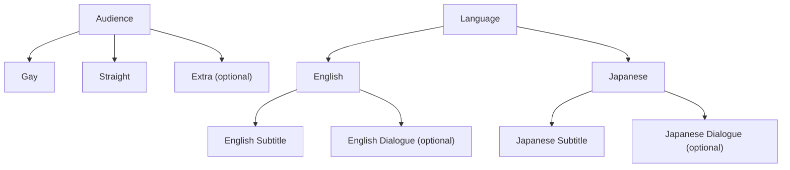

# E-Hentai Updater

Stash external plugin for galleries whose folder name is `gid_token`.

## What it does

- Fetches metadata from E-Hentai using the folder name.
- Updates gallery title, date, rating, URL and `organized`.
- Reuses existing `Audience` and `Language` tags when present.
- Auto-creates missing `Audience`, `Gay`, `Straight`, language parent tags, and `<Language> Subtitle` tags when needed.

## Expected Tag Structure

- `Audience` is a root tag.
- `Gay` and `Straight` must be direct children of `Audience`.
- Additional audience child tags are allowed, for example `Extra`.
- `Language` is a root tag.
- Each language tag such as `English` or `Japanese` is a direct child of `Language`.
- Each subtitle tag such as `English Subtitle` is a child of its language tag.
- Additional child tags under each language are allowed, for example `English Dialogue` or `Japanese Dialogue`.

## Requirements

- Stash external plugins enabled.
- Python available on `PATH` as `python3`.
- Gallery folders named like `123456_abcdef1234`.

## Notes

- The plugin no longer hardcodes your library path.
- The plugin no longer depends on fixed tag IDs from one specific Stash database.
- If your tag tree uses different names than `Audience`, `Gay`, `Straight`, or `Language`, adjust `constants.py`.
